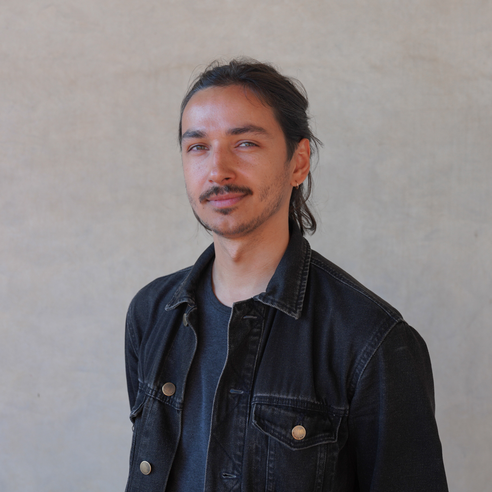
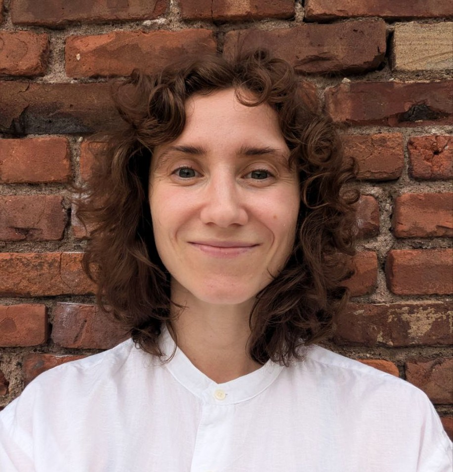
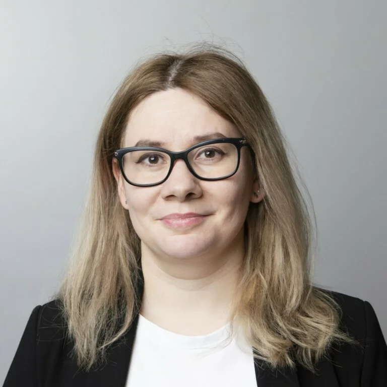
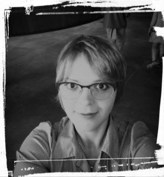

```{=html}
<style>
.title {
  font-size: 0px;
}

.collab-header {
  text-align: center;
  margin-bottom: 40px;
}

.collab-header h1 {
  margin-bottom: 10px;
  font-size: 2rem;
}

.collab-header p {
  max-width: 800px;
  margin: 0 auto;
  color: #666;
  font-size: 1rem;
}

.collab-grid {
  display: grid;
  grid-template-columns: repeat(2, 1fr);
  gap: 24px;
}

.collab-card {
  background: #fff;
  border: 1px solid #ececec;
  border-radius: 16px;
  padding: 24px;
  box-shadow: 0 4px 14px rgba(0,0,0,.05);
  transition: .2s ease;
}

.collab-card:hover {
  transform: translateY(-2px);
}

.collab-card img {
  width: 115px;
  height: 115px;
  object-fit: cover;
  border-radius: 50%;
  display: block;
  margin: 0 auto 12px auto;
}

.collab-card h3 {
  margin: 0;
  text-align: center;
  font-size: 1.15rem;
}

.collab-role {
  text-align: center;
  color: #777;
  font-size: .85rem;
  margin: 6px 0 16px 0;
}

.collab-card p {
  font-size: .92rem;
  line-height: 1.55;
  margin-bottom: 14px;
}

.collab-card a {
  font-weight: 600;
  text-decoration: none;
}

@media (max-width: 900px) {
  .collab-grid {
    grid-template-columns: 1fr;
  }
}
</style>

<div class="collab-header">
<h1>Research Collaborators</h1>
<p>
Scholars and colleagues with whom I collaborate on research related to migration, political behavior, authoritarianism, gender, and transnational politics.
</p>
</div>

<div class="collab-grid">

<div class="collab-card">

<h3>Emil Kamalov</h3>
<div class="collab-role">
Stanford University (CDDRL) • OutRush Co-PI
</div>
<p>
Postdoctoral Fellow at the Center on Democracy, Development and the Rule of Law (CDDRL), Stanford University. Holds a PhD from the European University Institute (EUI), Florence. His research focuses on political behavior, repression, and war-induced migration. Alongside Ivetta Sergeeva, he co-founded OutRush — a panel survey of Russian post-2022 emigrants — and ViolenceMonitor, a survey on intimate partner violence in Russia. Both projects have received wide coverage in the <em>New York Times</em>, <em>Financial Times</em>, <em>BBC</em>, and other international outlets.
</p>
<a href="https://emilkamalov.com/" target="_blank">Website →</a>
</div>

<div class="collab-card">

<h3>Ivetta Sergeeva</h3>
<div class="collab-role">
George Washington University • OutRush Co-PI
</div>
<p>
Senior Research Associate at the Elliott School of International Affairs, George Washington University, and Research Affiliate at CDDRL, Stanford. Holds a PhD from the European University Institute (EUI), Florence. Her research focuses on authoritarianism, civil society, and emigration, combining surveys, experiments, and interviews. She is Principal Investigator of the NSF-funded DemEx project and co-founder of OutRush and ViolenceMonitor alongside Emil Kamalov.
</p>
<a href="https://www.ivettasergeeva.com/" target="_blank">Website →</a>
</div>

<div class="collab-card">

<h3>Margarita Zavadskaya</h3>
<div class="collab-role">
Finnish Institute of International Affairs
</div>
<p>
Senior Research Fellow at the Finnish Institute of International Affairs. Holds a PhD from the European University Institute (EUI), Florence. Her research focuses on authoritarian states, mass protests, elections, and public opinion. She has published in <em>Democratization</em>, <em>East European Politics</em>, <em>Post-Soviet Affairs</em>, and other journals, and is co-editor of <em>Electoral Integrity and Political Regimes</em> (Routledge, 2018).
</p>
<a href="https://fiia.fi/en/expert/margarita-zavadskaya" target="_blank">Profile →</a>
</div>

<div class="collab-card">

<h3>Veronica Kostenko</h3>
<div class="collab-role">
Tel Aviv University • Gender Mosaic Project
</div>
<p>
Postdoctoral researcher at the Lowy International School, Tel Aviv University, as part of the Gender Mosaic Project. Holds a PhD in social sciences. Her research spans gender inequalities, migration, intersectionality, and comparative survey methods, with a focus on Muslim-majority societies and the Middle East. She also works on Russian post-2022 emigration, gender egalitarianism among emigrants, and migrant adaptation.
</p>
<a href="https://scholar.google.com/citations?user=Zk-wF8sAAAAJ&hl=en" target="_blank">Google Scholar →</a>
</div>
```
