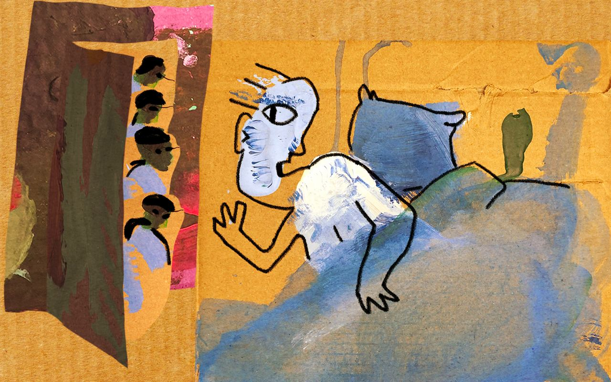
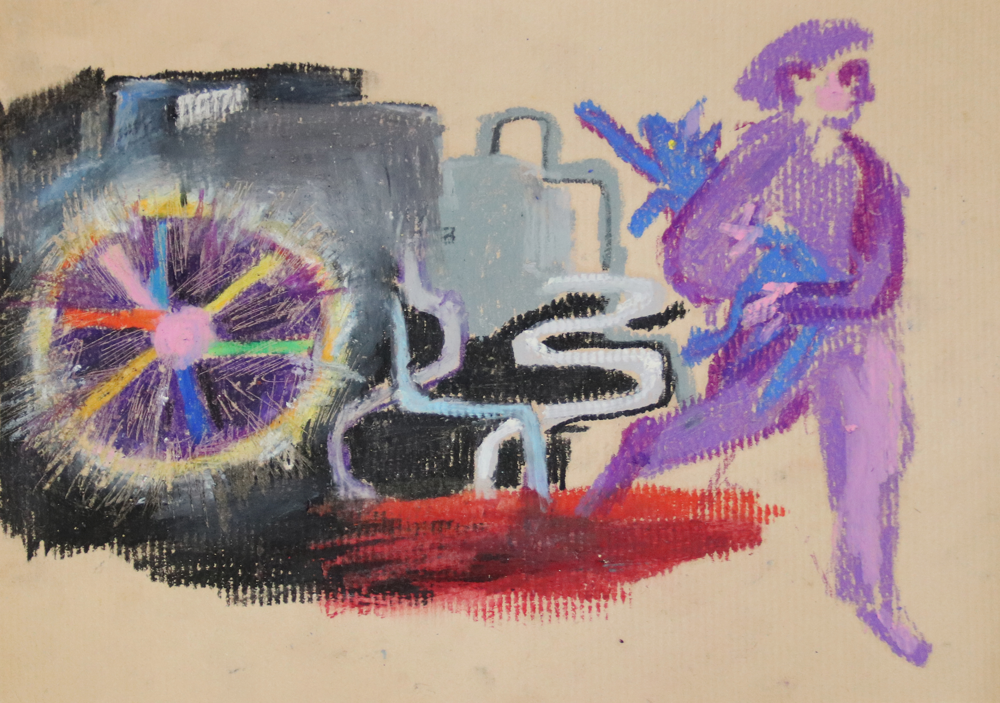

---
title: "Projects"
---

```{=html}
<style>
.title {
  font-size: 0px;
}

.project-card {
  border: 1px solid #e6e6e6;
  border-radius: 18px;
  padding: 24px 28px;
  margin: 26px 0;
  background: #ffffff;
  box-shadow: 0 6px 22px rgba(0,0,0,0.06);
}

.project-card h3 {
  margin-top: 0;
  font-size: 1.35rem;
  line-height: 1.35;
}

.project-meta {
  font-size: 0.9rem;
  color: #666;
  margin-bottom: 14px;
}

.project-tag {
  display: inline-block;
  padding: 4px 10px;
  margin: 4px 6px 8px 0;
  border-radius: 999px;
  background: #f1f1f1;
  font-size: 0.78rem;
  color: #333;
}

details {
  margin-top: 14px;
}

summary {
  cursor: pointer;
  font-weight: 600;
  color: #333;
}

.project-links a {
  font-weight: 600;
}

.figure-caption {
  word-wrap: break-word;
  font-size: 12px;
  color: #555;
  line-height: 1.35;
}
</style>
```

<div class="project-card">

### Panel Survey of Russian Post-2022 Emigrants: OutRush Project

<div class="project-meta">2022–ongoing | Co-Investigator</div>

<span class="project-tag">panel survey</span> <span class="project-tag">Russian emigration</span> <span class="project-tag">mixed methods</span> <span class="project-tag">political attitudes</span> <span class="project-tag">migration trajectories</span>

<details>
<summary>Details</summary>

#### Description

OutRush is one of the largest longitudinal studies of post-2022 Russian emigration. Launched shortly after the full-scale invasion of Ukraine, the project follows Russians who left the country after 24 February 2022 and examines how their political attitudes, migration trajectories, economic well-being, social integration, transnational ties, and intentions to return evolve over time.

Methodologically, OutRush combines annual panel survey waves, large-scale survey experiments, and in-depth qualitative interviews. This mixed-methods design allows researchers to analyse both population-level trends and individual experiences of migration, adaptation, political engagement, and identity transformation. The panel component makes it possible to follow the same respondents over multiple years and study long-term changes in attitudes, behaviours, and life outcomes.

To date, the project has completed five survey waves and collected responses from more than 30,000 participants across over 100 countries, making it one of the most comprehensive datasets on contemporary Russian migration. The project has generated academic publications, policy reports, and public-facing analyses, and its findings have been widely cited in international and independent media, including *The New York Times*, *Financial Times*, *Bloomberg*, *BBC*, *Al Jazeera*, and *Meduza*.

**My role:** Co-Investigator.

<div class="project-links">

[Website EN](https://outrush.io/eng#abouttheproject)
[Website RU](https://outrush.io/outrush)

<div class="project-visual-link">

<h4>Interactive Data Explorer</h4>

<p>
Explore cross-national variation in the difficulties experienced by Russian emigrants across host countries using the interactive OutRush visualisation.
</p>

<a href="https://outrush.io/maps_difficulties_4_eng"
target="_blank"
class="project-button">

Open Interactive Map →

</a>

</div>

</div>

</details>

</div>

<div class="project-card">

### Democracy in Exile Project

<div class="project-meta">2025–ongoing | Co-Investigator </div>

<span class="project-tag">democracy in exile</span> <span class="project-tag">war-induced migration</span> <span  class="project-tag">international collaboration</span>

<details>
<summary>Details</summary>

#### Description

Democracy in Exile is an international research project that builds on the OutRush panel survey to examine the long-term political, social, and emotional consequences of war-induced emigration. The project focuses on how exile reshapes political participation, democratic imaginaries, civic networks, and migrants’ relationships with both host societies and Russia.

DemEx is one of 18 international projects funded by the Trans-Atlantic Platform for Social Sciences and Humanities. The project is supported by the National Science Foundation in the United States, the National Science Centre in Poland, and the Social Sciences and Humanities Research Council in Canada.

</details>

</div>

<div class="project-card">

### Russians’ Dreams During the War in Ukraine: The Science of Dreams

<div class="project-meta">2022–ongoing | Principal Investigator</div>

<span class="project-tag">dream narratives</span> <span class="project-tag">war experience</span> <span class="project-tag">qualitative archive</span> <span class="project-tag">memory and emotion</span> <span class="project-tag">public sociology</span>

<details>
<summary>Details</summary>

#### Description

The Science of Dreams is an interdisciplinary research project that I co-founded and lead as Principal Investigator. The project collects, preserves, and analyses dream narratives produced by Russians during the war in Ukraine, treating dreams as a unique form of social testimony that captures experiences, emotions, fears, and political imaginaries often difficult to express in ordinary public discourse.

By gathering hundreds of first-person dream accounts, the project creates a unique archive documenting subjective experiences of war, displacement, uncertainty, repression, and social change. The collection provides rare insight into how large-scale political events are processed through memory, imagination, and everyday emotional life.

#### Goals

The project aims to build a systematically archived corpus of wartime dream narratives that can serve as a source for historical, sociological, cultural, psychological, and literary research. It explores how emotions, identity, memory, responsibility, fear, and political imagination are expressed and transformed through dreaming during periods of crisis and conflict.

The initiative also seeks to make these materials accessible through academic publications, public engagement, artistic collaborations, exhibitions, and media projects while ensuring contributors’ anonymity and safety.

#### Methods

The project combines qualitative, quantitative and interpretive approaches, including open calls for dream submissions, thematic coding, narrative analysis, and comparative interpretation. The resulting archive supports both scholarly research and collaborations with artists, writers, journalists, and cultural institutions interested in documenting lived experiences of war.

#### Impact

Materials collected through the project have already contributed to academic publications, public sociology initiatives, media essays, and artistic projects. By preserving intimate and often emotionally charged testimonies, the archive offers both valuable empirical material for researchers and a distinctive perspective on the social consequences of war.

#### Links

<div class="project-links">

[Website EN](https://readymag.com/u94255285/wardreams/2/)
[Website RU](https://readymag.com/u94255285/wardreams/1/)
[Telegram channel](https://t.me/scienceofdreams)

</div>

#### Dream Visualisations

<div class="dream-website-preview">

<a href="https://readymag.website/u94255285/wardreams/2/" target="_blank">
  
</a>

<p>
Explore the visual archive of wartime dream narratives on the project website.
</p>

</div>

#### Selected Dream Narratives

<div class="dream-carousel">

<div class="dream-card">

<p class="dream-caption">
Figure 1. Visualization of the dream, 2022. © Sonya Nikitina, all rights reserved, used with permission.
</p>
<p class="dream-text">
“I dreamed that I was in my old apartment. The front door is closed but unlocked. I close it with a latch, and suddenly, through the crack, I notice that there is someone behind it...”
</p>
<p class="dream-meta">(03/06/2022, F, age 20)</p>
</div>

<div class="dream-card">

<p class="dream-caption">
Figure 2. Visualization of the dream, 2022. © Agata Gilman, all rights reserved, used with permission.
</p>
<p class="dream-text">
“A mysterious celestial object falls to Earth near Moscow's water reservoirs; scientists announce that it can poison the water. The Russian authorities decide not to shoot down the object...”
</p>
<p class="dream-meta">(07/04/2022, F, age 29)</p>
</div>

<div class="dream-card">

<p class="dream-caption">
Figure 3. Visualization of the dream, 2022. © Sonya Nikitina, all rights reserved, used with permission.
</p>
<p class="dream-text">
“I came with a group of rescuers to the Mausoleum on Red Square. We received a signal that the mausoleum had been taken over many years ago by two crazy old women...”
</p>
<p class="dream-meta">(22/04/2022, F, age 48)</p>
</div>

</div>

</details>

</div>

<div class="project-card">

### A Qualitative Study of Feminist Anti-War Resistance Activists

<div class="project-meta">2022–2023 | Co-Investigator</div>

<span class="project-tag">feminist activism</span> <span class="project-tag">anti-war resistance</span> <span class="project-tag">exile</span> <span class="project-tag">qualitative interviews</span>

<details>
<summary>Details</summary>

#### Description

This qualitative research project examines the experiences of activists from the Feminist Anti-War Resistance (FAR), one of the largest anti-war movements that emerged in Russia following the full-scale invasion of Ukraine.

The study explores how activists adapt to exile, sustain political engagement under conditions of repression and displacement, transform emotions into political action, and build feminist forms of solidarity across borders. Particular attention is devoted to questions of gender, emotions, care, organisational practices, and long-term activist commitment.

The project is based on 55 in-depth interviews with FAR activists conducted across multiple countries. The interviews provide insight into everyday activist practices, emotional experiences, organisational dynamics, and the challenges of sustaining opposition politics in exile.

The project was conducted in collaboration with researchers from Indiana University and the University of Oslo.

**My role:** Co-Investigator.

#### Output

The findings of this project are presented in the article:

**Nugumanova, K. (2025). _Micromobilizing Emotion: How Feminist Anti-War Resistance Builds Feminist Affective Infrastructure in Exile_. Communist and Post-Communist Studies, 59(1), 104–129.**

[Read the article](https://online.ucpress.edu/cpcs/article-abstract/59/1/104/215179/Micromobilizing-EmotionHow-Feminist-Anti-War?redirectedFrom=fulltext)

</details>

</div>

<div class="project-card">

### Building a Commons in the Russian Post-2022 Diaspora

<div class="project-meta">2022–2023 | Researcher & Coordinator </div>

<span class="project-tag">Russian post-2022 diaspora</span> <span class="project-tag">community building</span> <span class="project-tag">migration experience</span> <span 
class="project-tag">large-N interviews </span>

<details>
<summary>Details</summary>

#### Description

Building a Commons in the Russian Post-2022 Diaspora is a large-scale qualitative research project examining how Russian emigrants rebuild social ties, create new communities, establish civic initiatives, and develop infrastructures of mutual support after migration.

The project investigates processes of community formation, solidarity, adaptation, political engagement, and everyday coping strategies among Russians who left the country after the full-scale invasion of Ukraine. Particular attention is paid to the emergence of migrant organisations, informal support networks, collective identities, and transnational connections across host societies.

The research team has conducted 587 semi-structured interviews with emigrants in Serbia, Kazakhstan, Armenia, Georgia, Kyrgyzstan, and Turkey. The resulting dataset constitutes one of the largest qualitative collections on post-2022 Russian migration.

The project brings together researchers from multiple institutions and disciplinary backgrounds, combining expertise in migration studies, sociology, political science, and qualitative methods.

**My role:** Researcher & Project Coordinator.

#### Contact

If you would like to participate in the interview in the future, please contact me via Telegram: @Karolina_Nugumanova1

</details>

</div>

